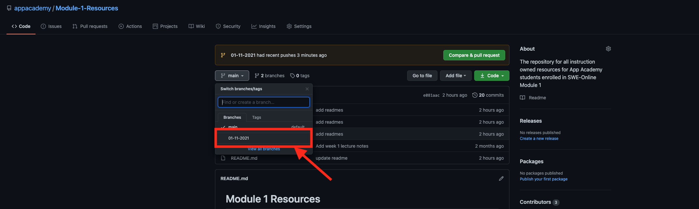

# Module 1 Resources

## Welcome to Module 1!
* Here you will find all resources that are associated to your cohort during your time in Module 1!  
## Lectures
* Lecture demos will be found in the branch associated to the current cohort you're in. You can find the lectures in the description of your slack channel or you can navigate to them from the main branch with these steps:

1. 
3. 
2. 

## Weekly Additional Resources
* These resources are additional resources that are relevant to the current week you're in. Feel free to explore and find some helpful resources that include cheat sheets and additional practice. 

## Reccomended Folder Structure 
* Organization is key when going through a fast course such as App Academy.  As a result here is a reccommended file structure that students can follow:
* `app_academy` (**folder**)
  * `week_1` (**folder**)
    * `w1d1` (**folder**)
      * `projects` (**folder**)
        * `file1.js` (**file**)
        * `file2.js` (**file**)
        * `file3.js` (**file**)
        * `file4.js` (**file**)
        * ...
      * `homework` (**folder**)
        * `file1.js` (**file**)
        * `file2.js` (**file**)
        * `file3.js` (**file**)
        * `file4.js` (**file**)
        * ...
    * `w#d#...`
  * `week_2` (**folder**)
    * `w2d1` (**folder**)
      * `projects` (**folder**)
        * `file1.js` (**file**)
        * `file2.js` (**file**)
        * `file3.js` (**file**)
        * `file4.js` (**file**)
        * ...
      * `homework` (**folder**)
        * `file1.js` (**file**)
        * `file2.js` (**file**)
        * `file3.js` (**file**)
        * `file4.js` (**file**)
        * ...
    * `w#d#...`
  * `week_#...`

 

