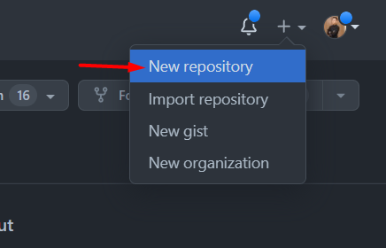
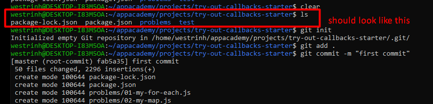
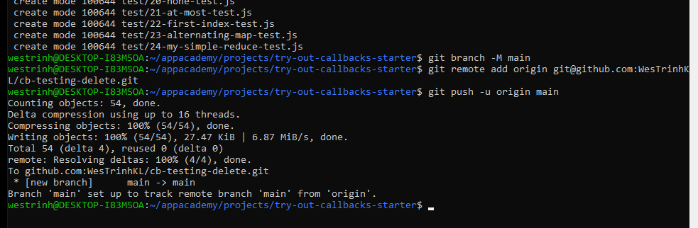

# Git Flow and Commands

## Jump to what you need

- [Git Flow and Commands](#git-flow-and-commands)
  - [Jump to what you need](#jump-to-what-you-need)
  - [Basic git commands](#basic-git-commands)
    - [Get & Create Project](#get--create-project)
    - [Save Your Work](#save-your-work)
    - [Share Your Work](#share-your-work)
    - [Other Useful Commands](#other-useful-commands)
  - [How to download a project](#how-to-download-a-project)
  - [Basic setup for pairing](#basic-setup-for-pairing)
    - [Creating a Repo](#creating-a-repo)
    - [PAT Setup](#pat-setup)
    - [Inviting Teammate](#inviting-teammate)
    - [Cloning a Repo](#cloning-a-repo)
  - [Adding gitignore file](#adding-gitignore-file)
    - [Creating the .gitignore file](#creating-the-gitignore-file)
    - [If you accidentally committed `node_modules`](#if-you-accidentally-committed-node_modules)
  - [Basic git flow for pairing](#basic-git-flow-for-pairing)

---

## Basic [git commands](https://git-scm.com/docs)

**These commands are for git on your local computer, git and github
are two separate things. If you're curious
[git vs. github](https://www.geeksforgeeks.org/difference-between-git-and-github/).**

### Get & Create Project
  
| Command | Description | Example |
| ------- | ----------- |---------|
| [git init](https://git-scm.com/docs/git-init) |  Creates an empty git repository inside your present working directory | `git init`
| [git clone *`your-github-link`*](https://git-scm.com/docs/git-init)  |   Creates a copy of the specified git repository inside your present working directory | `git clone//git@github.com/ [username][repository-name].git`
| | |

### Save Your Work
| Command | Description | Example |
| ------- | ----------- |---------|
|[git status](https://git-scm.com/docs/git-status) | Shows the current working state of the git repository |`git status`
|[git add *`<file-name>`*](https://git-scm.com/docs/git-add) | Add files to the staging area, you can use the dot operator to add everything to the staging area by typing *`git add .`* | `git add work.js`
|[git commit -m *`"<commit-message>"`*](https://git-scm.com/docs/git-commit)| Records all the added changes to the repository, write meaningful messages to remind yourself of what was done to the project| `git commit -m "first commit"`

### Share Your Work
| Command | Description | Example |
| ------- | ----------- |---------|
|[git remote add origin *`<github-link>`*](https://git-scm.com/docs/git-remote)| Connects your local git repository to a specified github repository, you should  only have to do this once and you will not have to do this if you used *`git clone`*| `git remote add origin git@github.com/[username][repository-name].git`
|[git push](https://git-scm.com/docs/git-push) | Updates github with any changes that have been committed on the local git repository, think uploading | `git push`
|[git pull](https://git-scm.com/docs/git-pull)| Updates your local git repository with any changes made to github, think downloading |`git pull`
| | |
  
### Other Useful Commands
| Command | Description | Example |
| ------- | ----------- |---------|
|[git branch -M *`<new-branch-name>`*](https://stackoverflow.com/questions/6591213/how-do-i-rename-a-local-git-branch) |Tech is ever evolving and in keeping up with the times it's best to be proactive  and change our main branch name to something more appropriate. This is a trend in tech that you should get used to. | `git branch -M main`
  

---
## How to download a project 

Reference <a href="https://open.appacademy.io/learn/js-py---mar-2022-cohort-1-online/week-1---intro-to-javascript/local-javascript-project" target="_blank">Week 1 Thursday here</a> for how to download a project from AA Open 

## Basic setup for pairing

**_Important:_ First determine who will create the repo on GitHub as the  
instructions for each partner will be different.**

### Creating a Repo

- ***ONLY ONE PERSON*** 
  - Create a repository on github by pressing the + create in the top right corner of your github. Click: `New repository`

  

- Name your repository and be sure to set it to private, also don't press any of the check boxes

  

- Connect your local git repository
  - Once you have created a repository it will bring you to a page with directions for setup
  - Recommended: Create a new local repository by entering these commands one line at a  
  time in the directory that you wish to become a git repository
  - **IMPORTANT**: Remember that `git add .` is the command to add all files to the staging area. `git add README.MD` will **not add** all your files.

  

***EXAMPLE***
  
- Run `ls` and make sure that the structure of the project you are pushing should look similar below (problems, test, etc.). Also notice `git add .` 
  
  - `ls`
  - `git init`
  - `git add .`
  - `git commit -m "first commit"`

- Add your repo origin provided by github
  - `git branch -M main`
  - `git remote add origin [your-github-repo-link]`
  - `git push -u origin main`
  

### PAT Setup

  If Github asks for your credentials (username / password). Your own password won't work. You will have to replace it with a Personal Access Token (PAT acts as your password). 
  [PAT SETUP LINK](https://github.com/appacademy/unified-setup/blob/main/github-setup.md#configuring-github)
  .
  
***IMPORTANT***
- When generating token: Make sure to check all the fields for repo permission.
- DO NOT show your PAT to anyone
- For WSL users, when pasting (right click) your PAT into the password section, your password will be invisible, it will seem like it's not there, but it is there. So only paste once.

### Inviting Teammate

Refresh your github; your repo should like something like below. If you run into any issues CALL AN INSTRUCTOR ASAP for help!
  

- Invite your partner
  - While on the page for the new repo click the settings cog above it should take you to  
  something that looks like this

    

  - Click on Invite Collaborator and search your partner's github username

    

- Lastly, your cohort is your most valuable resource during a/A make sure to follow each other  
on github to make it easier to share projects and work together!

### Cloning a Repo

- Once your pair has created a repository and invited you, you should receive an email  
on the account you linked when you created your github
- After you have accepted the invite in your email you should be redirected to  
something that looks like this  

- After accepting the invitation you will be redirected to the github repository  
where you can copy the link  

- Inside the directory you want to copy the project into run the command  
*`git clone "copied-link"`*
- You should now have all of the files and directories on your local machine, don't forget  
to follow your partner on github!

---

## Adding gitignore file
**_Important:_** If you ever `npm install` or if there's a `package.json` file, you will typically want a `.gitignore` file and ignoring the `node_modules` folder before pushing onto Github

### Creating the .gitignore file
The `.gitignore` file allows us to add files or directories that we **DO NOT** want to be commited or saved to our git history (therefore 'ignoring' it in 'git'). 
  - Remember, when you first run `npm install` it will create the `node_modules` directory and fetch the code dependencies that our project will need which will take the list of dependencies (ingredients) from the `package.json` file to download from.
    - 

  - Here, we do not want to push up the `node_modules` directory to our Github repository as the items inside it can become very big and it is unecessary to do so since anyone can fetch a list of those dependencies if they have the `package.json` file using `npm install`. `.gitignore` will be a great tool to handle this issue for us!

  - Create a `.gitignore` file on the same level as your `package.json`
    - 

  - Inside our `.gitignore` file, add the following text, `node_modules` which will now ignore the folder `node_modules` from being committed to our git history.
    - 

  - Now we just need to commit our updated `.gitignore` file:
    - `git add .` 
    - `git commit -m "message here"`
    - `git push`

### If you accidentally committed `node_modules`
  
  - If you happen to commit the `node_modules` directory to your history before adding the `.gitignore` file, then we can do this to remove it from our commit history:
    
    - run `git rm -r --cached node_modules`
    - add `.gitignore` file with `node_modules` in it like the example above if you haven't yet
    - run `git add .` 
    - run `git commit -m "message here"`
    - run `git push`

---

## Basic git flow for pairing
**IMPORTANT**
To avoid merge errors and conflict ONLY ONE person should be working on the SAME FILE at a time. TLDR: only one person should be coding, other navigating and then swap.

Once you and your pair are set up and working on the same repository things get a lot easier. As you switch back and forth from driver to navigator you will need to follow these steps.

Steps for the driver:

- Save your work
- Type ``git status`` into your terminal, you should see something like this:

  

- Type ``git add .`` in order to add all of your changes to the staging area
- Retype ``git status`` in order to confirm everything worked correctly:

  

- Type ``git commit -m <meaningful_commit>`` replacing meaningful_commit with your message
- Retype ``git status`` one last time:

  

- Type ``git push`` in order to send it up to GitHub:

  

- Wait for the navigator to pull
- Begin navigating

Steps for the navigator:

- Wait for the driver to push
- Type ``git pull``
- Begin driving
